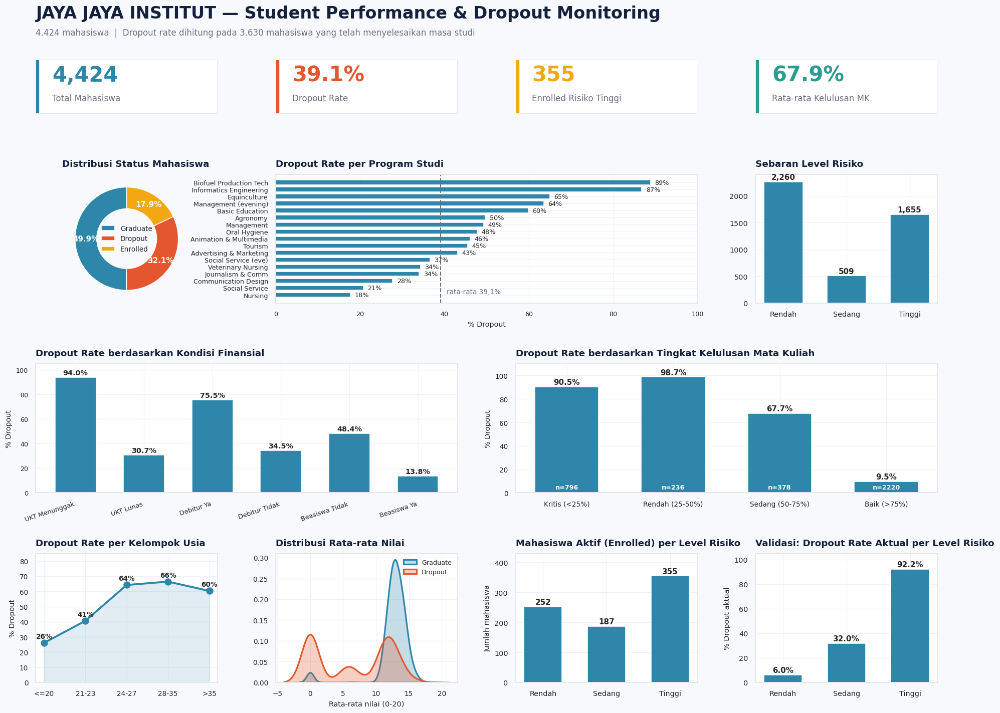

# Proyek Akhir: Menyelesaikan Permasalahan Institusi Pendidikan

- **Nama:** *Tegar Arifin Prasetyo*
- **Email:** *arifintegar12@gmail.com*
- **ID Dicoding:** *tegar_arifin_umpr*

## Business Understanding

Jaya Jaya Institut merupakan salah satu institusi pendidikan perguruan tinggi yang telah berdiri
sejak tahun 2000. Hingga saat ini institusi tersebut telah mencetak banyak lulusan dengan reputasi
yang sangat baik. Akan tetapi, terdapat banyak juga siswa yang tidak menyelesaikan pendidikannya
alias **dropout**.

Jumlah dropout yang tinggi tentunya menjadi salah satu masalah yang besar untuk sebuah institusi
pendidikan. Mahasiswa kehilangan waktu, biaya, dan peluang karier tanpa memperoleh gelar,
sementara institusi kehilangan pendapatan operasional, mengalami penurunan tingkat kelulusan, dan
berisiko turun peringkat akreditasi.

Oleh karena itu, Jaya Jaya Institut ingin **mendeteksi secepat mungkin siswa yang mungkin akan
melakukan dropout** sehingga dapat diberi bimbingan khusus. Selain itu, institusi juga
membutuhkan **dashboard** agar mudah dalam memahami data dan memonitor performa siswa.

### Permasalahan Bisnis

1. **Skala dan sebaran masalah belum terpetakan.** Institusi belum mengetahui program studi,
   jalur masuk, kelompok usia, atau kondisi finansial mana yang menjadi konsentrasi masalah
   dropout, sehingga alokasi sumber daya bimbingan tidak tepat sasaran.
2. **Faktor penyebab dropout belum teridentifikasi.** Belum diketahui variabel apa yang paling
   menentukan seorang mahasiswa akan dropout, sehingga intervensi yang diberikan bersifat
   coba-coba.
3. **Tidak ada mekanisme deteksi dini.** Institusi baru mengetahui seorang mahasiswa dropout
   setelah kejadiannya berlangsung, sehingga bimbingan khusus selalu terlambat diberikan.
4. **Tidak ada alat monitoring bagi manajemen.** Data mahasiswa tersimpan dalam bentuk mentah dan
   sulit dipahami oleh pihak non-teknis, sehingga pengambilan keputusan belum berbasis data.

### Cakupan Proyek

1. **Data understanding & EDA** — memahami struktur data mahasiswa beserta 37 variabelnya, serta
   menggali pola dropout berdasarkan faktor demografi, finansial, dan akademik.
2. **Data preparation** — penyaringan kohort (hanya mahasiswa yang telah menyelesaikan masa
   studi), perumusan target biner, encoding fitur kategorikal, standardisasi fitur numerik, dan
   pemisahan data latih/uji secara *stratified*.
3. **Modeling** — membandingkan tiga algoritma klasifikasi (Logistic Regression, Random Forest,
   HistGradientBoosting) menggunakan 5-fold cross validation.
4. **Evaluation** — pemilihan model terbaik, penyetelan *threshold* berbasis kebutuhan bisnis, dan
   analisis feature importance untuk menjawab pertanyaan "faktor apa yang menyebabkan dropout".
5. **Business dashboard** — membangun dashboard monitoring performa siswa bagi manajemen.
6. **Deployment** — men-*deploy* prototype machine learning berbasis Streamlit ke Streamlit
   Community Cloud agar dapat diakses secara remote.
7. **Action items** — menyusun rekomendasi konkret berbasis temuan data.

### Persiapan

**Sumber data:** [Students' Performance — Dicoding Academy](https://github.com/dicodingacademy/dicoding_dataset/tree/main/students_performance)

Dataset berisi 4.424 baris dan 37 kolom, tanpa nilai kosong maupun baris duplikat. Kolom target
`Status` memiliki tiga kelas: `Graduate` (2.209), `Dropout` (1.421), dan `Enrolled` (794).

**Versi Python yang digunakan:** `Python 3.12.3`

**Versi pustaka utama:**

| Pustaka | Versi |
|---|---|
| scikit-learn | 1.8.0 |
| pandas | 2.2.0+ |
| numpy | 1.26.0+ |
| streamlit | 1.36.0+ |
| joblib | 1.4.0+ |
| matplotlib | 3.8.0+ |
| seaborn | 0.13.0+ |

**Setup environment:**

```bash
# 1. Kloning atau unduh repositori proyek ini
git clone <URL-REPOSITORI-ANDA>
cd <NAMA-FOLDER-PROYEK>

# 2. Pastikan versi Python sesuai
python --version        # harus Python 3.12.x

# 3. Buat dan aktifkan virtual environment
python -m venv venv
source venv/bin/activate        # Windows: venv\Scripts\activate

# 4. Pasang seluruh dependensi
pip install -r requirements.txt

# 5. Jalankan notebook analisis (opsional)
jupyter notebook notebook.ipynb
```

**Struktur berkas proyek:**

```
.
├── README.md                       # Dokumentasi proyek (berkas ini)
├── notebook.ipynb                  # Proses lengkap: EDA → modeling → evaluasi
├── app.py                          # Prototype Streamlit (deteksi dini dropout)
├── prediction.py                   # Skrip inferensi berbasis CLI
├── requirements.txt                # Daftar dependensi
├── data.csv                        # Dataset mentah
├── model/
│   ├── dropout_model.joblib        # Pipeline model final + threshold
│   └── defaults.json               # Nilai default tiap fitur
└── dashboard/
    ├── dashboard.png               # Tangkapan layar business dashboard
    ├── students_dashboard.csv      # Dataset siap pakai untuk BI tool
    ├── enrolled_prediksi.csv       # Daftar prioritas 794 mahasiswa aktif
    ├── eda_overview.png
    ├── feature_importance.png
    └── model_evaluation.png
```

---

## Catatan Perumusan Target Pemodelan

Tujuan model adalah memprediksi apakah seorang mahasiswa akan **Dropout** atau **Graduate**.
Karena itu, hanya mahasiswa yang **telah menyelesaikan masa studinya** yang dilibatkan dalam
proses training:

| Kohort | Jumlah | Perlakuan |
|---|---|---|
| `Dropout` + `Graduate` | **3.630** | Dipakai melatih dan menguji model (target: Dropout = 1, Graduate = 0) |
| `Enrolled` | **794** | **Tidak dipakai untuk training.** Disimpan terpisah dan menjadi sasaran prediksi |

Mahasiswa berstatus `Enrolled` dikeluarkan dari training karena:

1. `Enrolled` adalah status **sementara** — mahasiswa masih berjalan dan hasil akhirnya belum
   diketahui. Menggabungkannya dengan `Graduate` menjadi label 0 akan membuat target **ambigu**,
   sebab sebagian dari mereka sesungguhnya akan dropout di kemudian hari. Label yang keliru
   seperti ini menurunkan validitas model.
2. Kelompok `Enrolled` justru merupakan **populasi sasaran** sistem ini. Mereka adalah data yang
   **diprediksi**, bukan data yang melatih.

**Verifikasi distribusi target** pada kohort pemodelan: `Graduate` 2.209 (60,9%) dan `Dropout`
1.421 (39,1%), dengan rasio ketidakseimbangan hanya **1 : 1,55**. Proporsi ini cukup seimbang
sehingga model dapat belajar dengan baik tanpa perlu teknik *oversampling* seperti SMOTE;
penggunaan `class_weight="balanced"` dan penyetelan threshold sudah memadai.

---

## Business Dashboard

Business dashboard **Student Performance & Dropout Monitoring** dibangun untuk membantu manajemen
Jaya Jaya Institut memahami data dan memantau performa siswa tanpa perlu menjalankan kode.



**Tautan dashboard:** https://datastudio.google.com/reporting/ec0c2142-c50d-468b-90ab-1c43c27a062a

### Komponen Dashboard

Dashboard terdiri atas empat kartu KPI dan sembilan panel visualisasi:

| Komponen | Informasi yang disajikan |
|---|---|
| **KPI Cards** | Total mahasiswa (4.424), dropout rate kohort selesai (39,1%), mahasiswa aktif berisiko tinggi (355), rata-rata tingkat kelulusan mata kuliah (67,9%) |
| **Distribusi Status Mahasiswa** | Proporsi Graduate / Dropout / Enrolled |
| **Dropout Rate per Program Studi** | Peringkat 17 program studi terhadap garis rata-rata institusi |
| **Sebaran Level Risiko** | Jumlah mahasiswa pada kategori risiko Rendah / Sedang / Tinggi |
| **Kondisi Finansial** | Dropout rate berdasarkan status UKT, status debitur, dan kepemilikan beasiswa |
| **Tingkat Kelulusan Mata Kuliah** | Dropout rate pada kategori performa Kritis / Rendah / Sedang / Baik |
| **Kelompok Usia** | Tren dropout rate menurut usia saat mendaftar |
| **Distribusi Nilai** | Perbandingan sebaran rata-rata nilai Graduate versus Dropout |
| **Mahasiswa Aktif per Level Risiko** | Jumlah mahasiswa `Enrolled` yang perlu diintervensi |
| **Validasi Level Risiko** | Dropout rate aktual pada tiap level risiko keluaran model |

Seluruh bar chart menggunakan **satu warna seragam**. Pembedaan kategori sudah cukup diwakili oleh
label pada sumbu, sehingga variasi warna tidak diperlukan dan justru berpotensi menimbulkan
distraksi visual. Warna berbeda hanya dipakai pada panel yang memang membandingkan dua kelas
(Graduate versus Dropout).

### Cara Membangun Ulang Dashboard

Dataset siap pakai tersedia pada `dashboard/students_dashboard.csv` (4.424 baris, 33 kolom) dengan
seluruh kode kategorikal telah diterjemahkan ke label yang mudah dibaca serta dilengkapi kolom
turunan `Approval_Rate`, `Kategori_Performa`, `Skor_Risiko`, `Level_Risiko`, dan `Kohort`.

Dua catatan teknis pada berkas tersebut:

- Kolom **`Is_Dropout` sengaja dikosongkan** untuk mahasiswa `Enrolled`, sehingga saat dashboard
  menghitung rata-rata dropout rate, kelompok yang hasil akhirnya belum diketahui tidak ikut
  mengencerkan angka.
- Kolom **`Kohort`** (`Telah Selesai` / `Masih Aktif`) disediakan agar dashboard tetap dapat
  memfilter kedua kelompok tersebut secara eksplisit.

**Opsi A — Looker Studio:**

1. Unggah `dashboard/students_dashboard.csv` ke Google Sheets.
2. Buka [Looker Studio](https://lookerstudio.google.com/) → **Create** → **Report** → hubungkan
   sumber data Google Sheets tersebut.
3. Buat metrik `Dropout Rate` dari kolom `Is_Dropout` dengan agregasi **Average** dan tipe
   **Percent**.
4. Susun scorecard dan chart mengikuti tabel komponen di atas.
5. Klik **Share** → ubah akses menjadi **Anyone with the link can view**, lalu salin tautannya.

**Opsi B — Metabase (Docker):**

```bash
# 1. Jalankan container Metabase
docker run -d -p 3000:3000 --name metabase metabase/metabase

# 2. Buka http://localhost:3000, buat akun root@mail.com / root123

# 3. Unggah students_dashboard.csv, bangun question, susun jadi dashboard

# 4. Ekspor database instance Metabase
docker cp metabase:/metabase.db/metabase.db.mv.db ./
```

---

## Menjalankan Sistem Machine Learning

Prototype machine learning dibangun menggunakan **Streamlit** dan memiliki dua mode operasi:

- **Prediksi Individu** — formulir input profil mahasiswa (profil & pendaftaran, kondisi
  finansial, akademik semester 1, akademik semester 2). Keluarannya berupa skor risiko 0–100,
  level risiko, keputusan berdasarkan threshold, serta daftar rekomendasi tindak lanjut yang
  disesuaikan dengan faktor risiko yang terdeteksi.
- **Prediksi Massal** — unggah berkas CSV berisi banyak mahasiswa sekaligus, lalu sistem
  menghasilkan ringkasan jumlah mahasiswa per level risiko, daftar prioritas intervensi terurut
  dari skor tertinggi, dan tombol unduh hasil dalam format CSV.

### Tautan Prototype

**Streamlit Community Cloud:** https://jaya-jaya-institut-dropout.streamlit.app

### Menjalankan Secara Lokal

```bash
# Pastikan dependensi sudah terpasang
pip install -r requirements.txt

# Jalankan aplikasi
streamlit run app.py
```

Aplikasi akan terbuka otomatis pada `http://localhost:8501`.

### Menjalankan Melalui Command Line

```bash
# Prediksi satu mahasiswa
python prediction.py --single \
    Curricular_units_1st_sem_approved=0 \
    Curricular_units_2nd_sem_approved=0 \
    Tuition_fees_up_to_date=0 Debtor=1 Age_at_enrollment=30

# Keluaran:
# Skor risiko dropout : 100.0%
# Level risiko        : Tinggi
# Keputusan (thr 0.688) : BERISIKO DROPOUT

# Prediksi massal dari berkas CSV
python prediction.py --input data.csv --output hasil_prediksi.csv
```

### Cara Deploy ke Streamlit Community Cloud

1. Unggah seluruh isi folder proyek ini ke sebuah repositori **GitHub publik** — pastikan
   `app.py`, `requirements.txt`, dan folder `model/` ikut terunggah.
2. Buka [share.streamlit.io](https://share.streamlit.io/) dan masuk menggunakan akun GitHub.
3. Klik **New app**, pilih repositori dan branch yang sesuai, lalu isi *Main file path* dengan
   `app.py`.
4. Klik **Deploy**. Proses instalasi dependensi berlangsung sekitar 2–5 menit.
5. Salin URL aplikasi yang dihasilkan ke bagian *Tautan Prototype* di atas.

### Ringkasan Model

| Aspek | Keterangan |
|---|---|
| Algoritma | **Logistic Regression** (scikit-learn), `class_weight="balanced"` |
| Kohort pelatihan | 3.630 mahasiswa (Dropout + Graduate); Enrolled dikecualikan |
| Target | Biner — `Dropout` (1) vs `Graduate` (0) |
| Jumlah fitur | 36 (17 kategorikal + 19 numerik) |
| Preprocessing | `StandardScaler` + `OneHotEncoder` dalam satu `Pipeline` |
| Threshold operasional | 0,688 (disetel dari prediksi out-of-fold data latih) |
| **Accuracy** (data uji) | **0,935** |
| **Precision** (Dropout) | **0,937** |
| **Recall** (Dropout) | **0,894** |
| **F1-Score** (Dropout) | **0,915** |
| **ROC-AUC** | **0,975** |
| **PR-AUC** | **0,973** |

**Perbandingan ketiga model** (data uji, threshold default 0,5):

| Model | CV ROC-AUC | Accuracy | Recall | F1 | ROC-AUC | PR-AUC |
|---|---|---|---|---|---|---|
| **Logistic Regression** | 0,9455 | 0,9201 | 0,9401 | 0,9020 | **0,9753** | **0,9726** |
| Random Forest | 0,9459 | 0,9256 | 0,8908 | 0,9036 | 0,9724 | 0,9688 |
| HistGradientBoosting | 0,9442 | 0,9229 | 0,8768 | 0,8989 | 0,9682 | 0,9671 |

Setelah target dibersihkan dari ambiguitas kelas `Enrolled`, batas antara Dropout dan Graduate
menjadi cukup jelas sehingga **model linier sederhana sudah memadai** dan tidak kalah dari
ensemble yang jauh lebih kompleks. Model ini juga lebih ringan saat di-*deploy*.

---

## Conclusion

Proyek ini berhasil menjawab keempat permasalahan bisnis Jaya Jaya Institut.

**1. Skala dan sebaran masalah kini terpetakan.**
Dari 4.424 mahasiswa, sebanyak **3.630 telah menyelesaikan masa studinya** dan **1.421 di
antaranya dropout** — setara **39,1%** dari kohort tersebut. Masalah ini tidak merata, melainkan
terkonsentrasi pada program studi tertentu: **Biofuel Production Technologies (88,9%)**,
**Informatics Engineering (86,8%)**, **Equinculture (65,0%)**, **Management kelas malam (63,6%)**,
dan **Basic Education (59,9%)**. Sebaliknya **Nursing (17,7%)** dan **Social Service (20,8%)**
merupakan yang paling aman. Dropout rate juga meningkat tajam seiring usia pendaftaran, dari
**26,1%** pada kelompok ≤20 tahun menjadi **66,4%** pada kelompok 28–35 tahun.

**2. Faktor penentu dropout telah teridentifikasi.**
Hasil EDA dan permutation importance secara konsisten menunjuk dua kelompok faktor dominan:

- **Performa akademik dua semester pertama.** Jumlah mata kuliah yang lulus pada semester 2
  (`Curricular_units_2nd_sem_approved`) adalah prediktor tunggal terkuat, disusul semester 1.
  Mahasiswa dengan tingkat kelulusan mata kuliah **di atas 75%** hanya dropout **9,5%**, sedangkan
  seluruh kelompok di bawah ambang itu berada pada **67,7% hingga 98,7%**. Rata-rata mahasiswa
  dropout hanya meluluskan 2,55 mata kuliah di semester 1 dan 1,94 di semester 2, dibandingkan
  6,23 dan 6,18 pada kelompok lulusan.
- **Kondisi finansial.** Mahasiswa yang **menunggak UKT** dropout pada tingkat **94,0%** dibanding
  **30,7%** pada yang lunas. Mahasiswa berstatus **debitur** dropout **75,5%**, sedangkan
  **penerima beasiswa** jauh lebih aman dengan hanya **13,8%**.

Temuan paling penting justru terletak pada apa yang **tidak** berpengaruh: nilai ujian masuk
(`Admission_grade`) hampir tidak membedakan kelompok dropout (**124,96**) dan lulusan
(**128,79**). Artinya, **dropout di Jaya Jaya Institut bukan masalah kualitas seleksi calon
mahasiswa, melainkan masalah dukungan selama masa studi** — terutama dukungan finansial dan
pendampingan akademik.

**3. Sistem deteksi dini telah tersedia dan terbukti akurat.**
Model Logistic Regression mencapai **ROC-AUC 0,975**, **akurasi 93,5%**, **precision 93,7%**, dan
**recall 89,4%** pada data uji. Dari 284 mahasiswa dropout pada data uji, **254 berhasil
terdeteksi lebih awal** dan hanya 30 yang lolos, dengan hanya 17 kasus *false positive*. Level
risiko yang dihasilkan juga terkalibrasi dengan baik: kelompok **Risiko Tinggi memiliki dropout
rate aktual 92,2%**, Sedang 32,0%, dan Rendah hanya 6,0% — sehingga daftar prioritas yang muncul
di dashboard benar-benar dapat dipercaya. Karena prediktor utamanya adalah data akhir semester 2,
deteksi dapat dilakukan **sejak tahun pertama**, memberi institusi waktu intervensi yang memadai.

**4. Alat monitoring telah dibangun.**
Business dashboard dan prototype Streamlit memungkinkan manajemen memantau performa siswa serta
menghasilkan daftar prioritas intervensi secara mandiri, tanpa perlu menjalankan kode.

**Dampak yang langsung dapat dieksekusi.** Ketika model diterapkan pada **794 mahasiswa yang masih
aktif** (kohort `Enrolled` yang sengaja tidak dipakai untuk training), teridentifikasi **355
mahasiswa (44,7%) berisiko tinggi** yang perlu segera mendapat bimbingan khusus. Daftar lengkapnya
tersedia pada `dashboard/enrolled_prediksi.csv`. Dengan recall 89,4%, sekitar **317 di antaranya
benar-benar akan dropout** bila tidak ada intervensi. Apabila program bimbingan berhasil
menyelamatkan 30% saja dari kelompok tersebut, institusi mempertahankan sekitar **95 mahasiswa**
hanya dari satu siklus prediksi.

### Rekomendasi Action Items

**1. Terapkan sistem deteksi dini di akhir setiap semester.**
Jalankan prediksi massal terhadap seluruh mahasiswa aktif setiap akhir semester menggunakan
prototype Streamlit, lalu terbitkan daftar prioritas berdasarkan skor risiko. Mulai dari **355
mahasiswa Risiko Tinggi** yang sudah teridentifikasi pada berkas `enrolled_prediksi.csv`. Tetapkan
satu dosen wali sebagai penanggung jawab untuk setiap 10 mahasiswa berisiko tinggi, dan wajibkan
kontak pertama dilakukan dalam dua minggu pertama semester berikutnya.

**2. Jadikan keringanan biaya sebagai intervensi prioritas utama.**
Karena tunggakan UKT berasosiasi dengan dropout rate **94,0%**, sediakan skema cicilan fleksibel,
penundaan pembayaran, atau dana talangan darurat. Lakukan **kontak proaktif** kepada setiap
mahasiswa yang tunggakannya melewati 30 hari — jangan menunggu mahasiswa mengajukan sendiri,
karena mereka yang paling terdampak umumnya justru paling enggan meminta bantuan.

**3. Perluas dan targetkan ulang alokasi beasiswa.**
Penerima beasiswa hanya dropout 13,8% dibanding 48,4% pada non-penerima. Prioritaskan alokasi
beasiswa bagi mahasiswa berskor risiko tinggi yang masih menunjukkan potensi akademik, dan
naikkan kuota khusus untuk program studi dengan dropout rate tertinggi.

**4. Terapkan aturan pemicu akademik otomatis (*academic trigger*).**
Tetapkan aturan sederhana yang dapat dijalankan dosen wali tanpa bantuan model: mahasiswa dengan
tingkat kelulusan mata kuliah **di bawah 75%** pada semester berjalan otomatis dijadwalkan
konseling akademik, program remedial, dan peninjauan ulang beban SKS. Ambang 75% dipilih karena
di bawahnya risiko dropout melonjak dari 9,5% menjadi di atas 67%. Aturan ini berfungsi sebagai
lapisan pengaman apabila sistem prediksi sedang tidak tersedia.

**5. Audit program studi berisiko tinggi.**
Lakukan evaluasi menyeluruh terhadap kurikulum, beban studi, kualitas pengajaran, dan fasilitas
pada **Biofuel Production Technologies (88,9%)** dan **Informatics Engineering (86,8%)**, diikuti
Equinculture dan Management kelas malam. Dropout rate mendekati 90% mengindikasikan adanya masalah
struktural pada program tersebut, bukan sekadar kumpulan masalah individual mahasiswa.

**6. Rancang dukungan khusus bagi mahasiswa non-tradisional.**
Mahasiswa yang mendaftar pada usia di atas 24 tahun, masuk melalui jalur *"Over 23 years old"*,
atau mengambil kelas malam menunjukkan risiko jauh lebih tinggi (di atas 60%). Sediakan kelas
hybrid, jadwal fleksibel, layanan penitipan anak, dan pendampingan manajemen waktu bagi kelompok
ini.

**7. Jadikan dashboard basis rapat evaluasi rutin, dan perbarui model setiap tahun.**
Tetapkan rapat evaluasi bulanan berbasis dashboard dengan tiga indikator utama: jumlah mahasiswa
aktif Risiko Tinggi, dropout rate per program studi, dan proporsi tunggakan UKT. Latih ulang model
setiap tahun ajaran menggunakan data terbaru — termasuk mahasiswa `Enrolled` yang statusnya kini
sudah final — agar performanya tetap terjaga seiring perubahan karakteristik mahasiswa.
